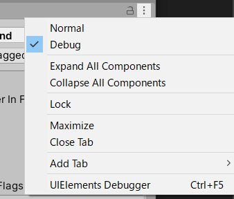
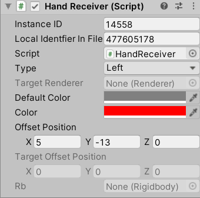
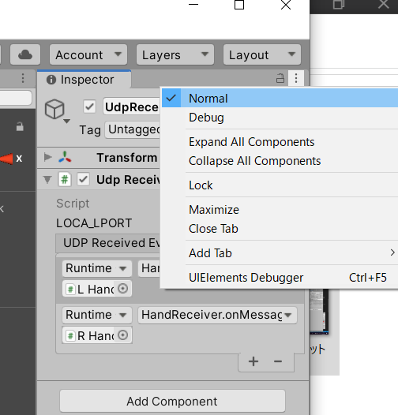
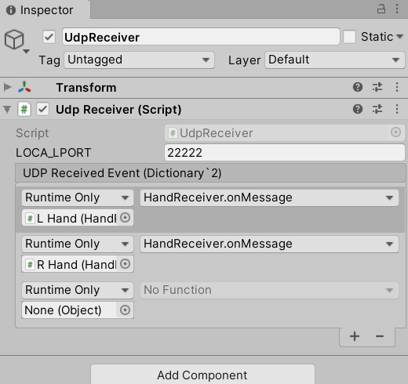

# Leap Motion UDP Receiver Unity
[Leap-Motion-UDP-Sender](https://github.com/LeapMotion-UDP-Unity/Leap-Motion-UDP-Sender) からUDPで送信された JSONを受信する Unityコード

# Unity への取り込み手順

1. 組み込みたいプロジェクトを開く
2. `src/LeapMotionUdpReceiver.unitypackage` をダブルクリックして取り込む
3. UDP 受信処理を追加する
   1. GameObject を追加して名前を `UdpReceiver` にする。
   2. Inspector で スクリプトに `UdpReceiver.cs` を関連付ける
   3. `UDP Received Event` 欄を2行追加する
4. Inspector を Debugモード にする。
   
5. 手のひらを表現するオブジェクトを追加する
   1. Sphere(球体)を2個プロジェクトに追加する
   2. それぞれ LHand,RHand 等の名前をつける。 
   3. Sphereに Rigidbody を設定。`Use Gravity` のチェックを外す
   4. スクリプトに `HandReceiver.cs` を関連付ける
   5. Inspector で HandReceiver の設定を変更する
      1. `type` を 左手 left , 右手 right
      2. `color` を 変更
      3. `offset Position` を調整 初期位置 
       
6. Inspector を Normalモード にする。

7. 4で作成した `UdpReceiver` の `UDP Received Event` に Sphere を設定する
   1. Sphere LHand,RHand を None(object) 欄にドラッグ＆ドロップする
   2. `Function` 部分を `HandReceiver.onMessage` を設定する

# 構成

# 参考サイト等
